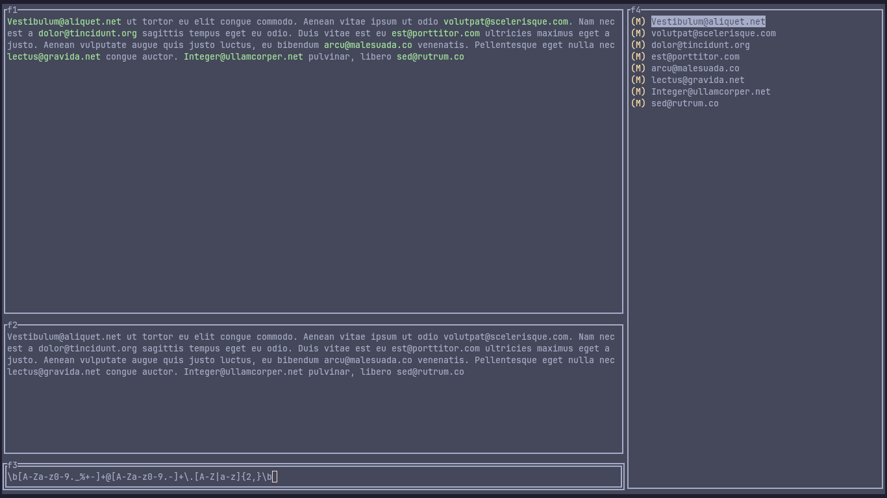

# A CLI regular expression tester



<video width="320" height="240" controls>
  <source src="./screenshots/.mp4" type="video/mp4">
</video>

## Requirements
- [golang](https://go.dev/)

## Installation (Build from source)
```
git clone https://github.com/Ayobami0/regex-cli.git && cd regex-cli
go build -o regex-cli main.go
```

## Running
```
regex-cli

```

